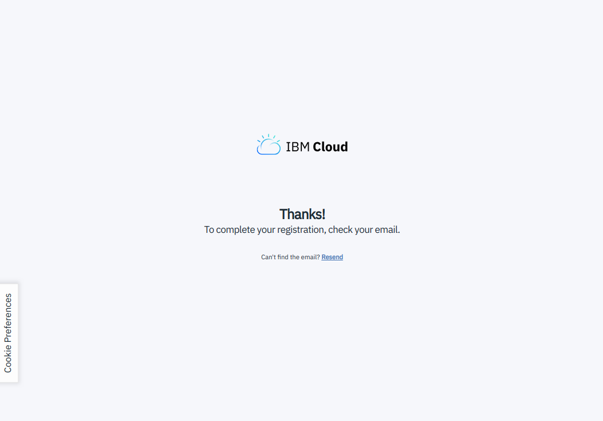
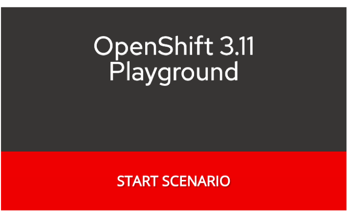
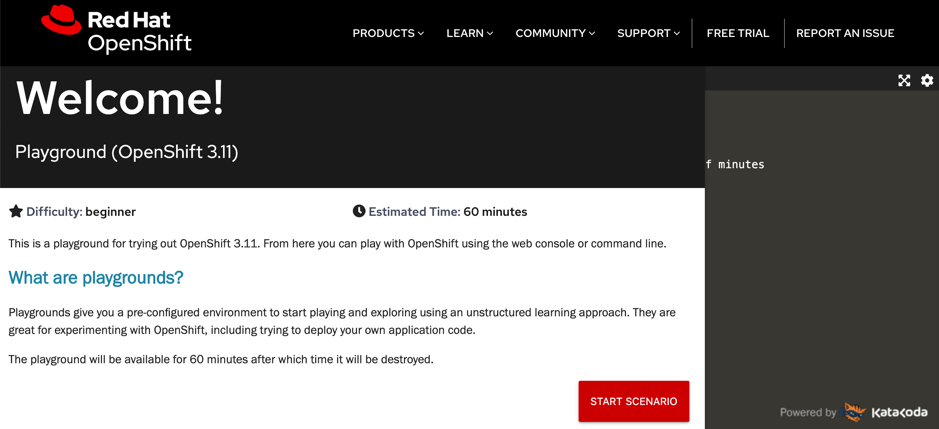
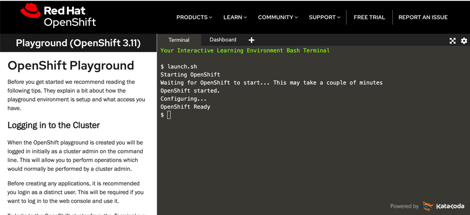
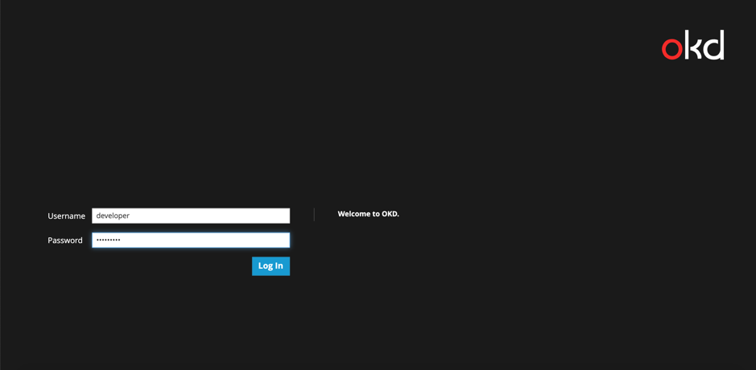
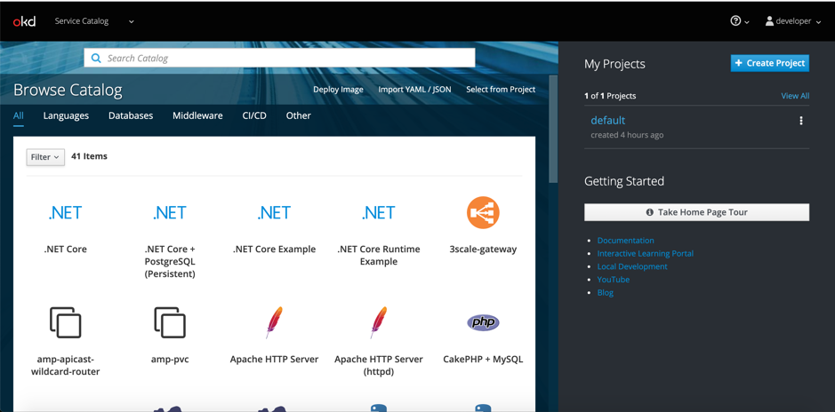
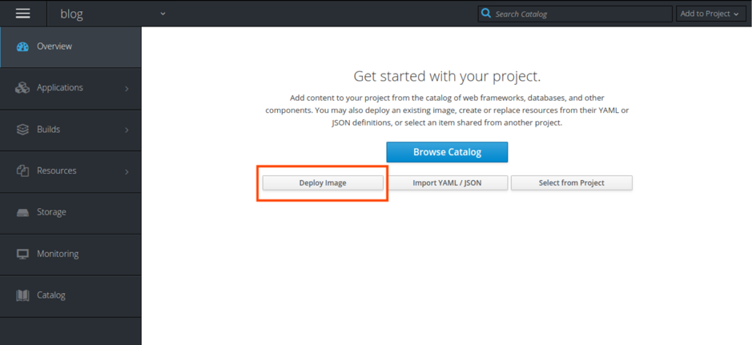
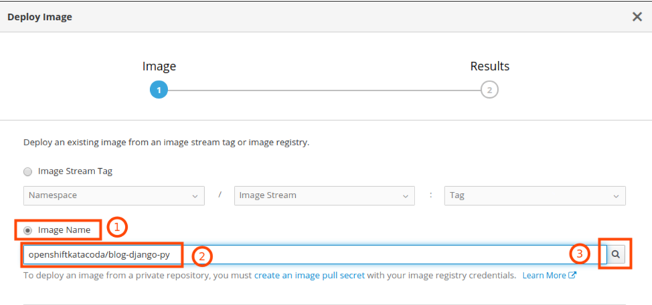
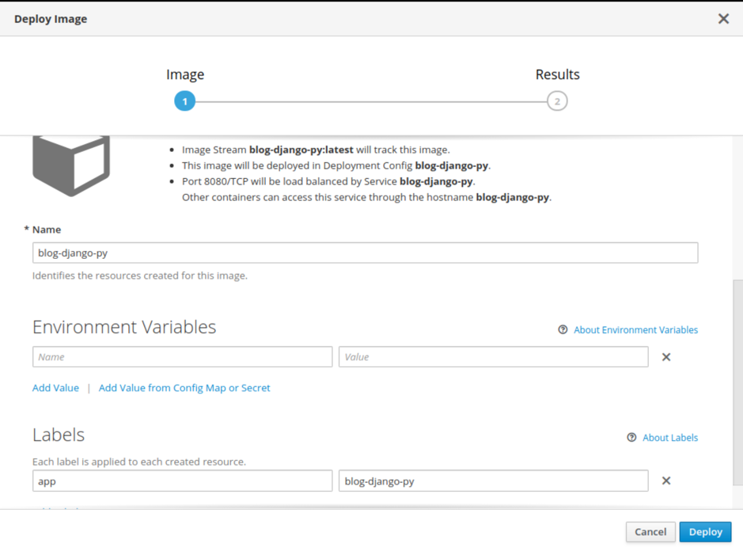
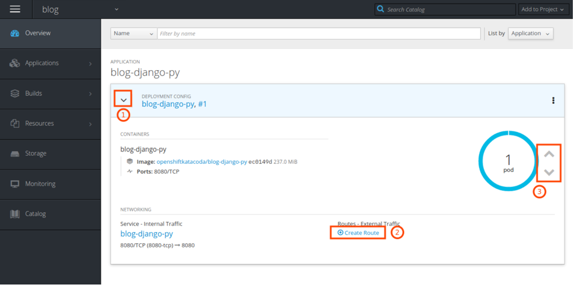

# Welcome to the Openshift India tour tutorial:
This part of the workshop is divided in two sections:   
1)Accessing IBM Cloud - the Free Lite Account   
2)Getting started on Openshift Platform
- Working with the OpenShift Web Console
- Working with the occommand line tool

## Accessing IBM Cloud - the Free Lite Account

This section will help you in accessing IBM Cloud with a free lite account.
1) Sign up on IBM Cloud or login here : http://ibm.biz/kwrowt-101

#### You created a new IBM Cloud lite account    
Congratulations! You have created a new IBM Cloud lite account. Now you can use it for free, taking advantage of its free tier.


#### 2. Activate your account
Click on the confirmation link in the email you received from IBM to activate your cloud account. Make sure you check the spam folder in your email. Now you are ready to access your IBM Cloud Dashboard, and check the Next Steps section.

#### Next Steps
When you have successfully finished sign up process - you are ready for the next steps. Please claim your pre-provisioned cluster, and set up your environment for the labs.

## Getting started on Openshift Platform

### A. Deploy an application from the Web Console

1) Login to https://learn.openshift.com/

2) Once the user has logged into the portal ,please click on the **Openshift Playgrounds- Start Course** .The user will be navigated to Interactive Learning Portal.

3) Click on the **OpenShift 3.11 Playground** Start Scenario.



The user will be landed to below page - 


4) Click on **Start Scenario** button.

Be ready to get started with the Openshift Playground by accessing the action items mentioned in the left panel.



Keep following the below mentioned steps as mentioned in the portal and continue with the workshop. 

Steps-

1. Click on the Dashboard tab at the top.


2. Use the below credentials to login to the web console:

* Username: developer
* Password: ********



3. Once the user is successfully logged in , you should be able to view the web console dashboard.


4. In the OpenShift Web Console, click "+ Create Project" and give your project a name, e.g. "blog". Click "Create".

The user should be able to see message like below - 


5. Click on your new project "blog" in the "My Projects" list. This opens the projects Overview, which is empty and offers you some "Get started" options.


6. Click on "Deploy Image".

7. Select "Image Name" and enter `openshiftkatacoda/blog-django-py` as name, then click on the "magnifying glass". 


8.  OpenShift reads details from the image and displays them. It fills in a name, based on the image name, and a label "app" whose content is also based on the image name. 



9. Leave the defaults and click "Deploy". In the resulting dialog click the "Continue to the project overview" link.


10. In the project overview, click on the twistie (1) to open the overview of the application. This example should be familiar, it was used in the second tutorial on the Red Hat Learning portal. Create a Route (2), accept the defaults, and click on the resulting URL. The blog application should open. If you want, scale the deployment up and down (3).



### B. Deploy an application with `oc` from the command line 

The OpenShift `oc` command line tool includes all the functionality of the Kubernetes native `kubectl` CLI but it has also all the function required for OpenShift specifics, e.g. a `login` command to access the OpenShift cluster.

### Install the OpenShift `oc` CLI

Go back to the learn.openshift.com window which was opened previously.
Verify whether you are on the Terminal window and should be able to access it.

### Login to the OpenShift Cluster

Once `oc` is installed, copy the login command from the OpenShift Web Console and paste it into a command window (shell). It will look similar to this:

```
$ oc login https://c100-e.us-south.containers.cloud.ibm.com:30*** --token=z5cuqxABC-9QdqE1ivXYZ1z_Y6Tghj1qxN-abCWc1Bg
```

If login is successfull you will see all the projects on OpenShift that you have access to. 

Keep the command line open but go back to the OpenShift Web Console.

### Working with the `oc` CLI


1. Go back to your command line where you used `oc`to logon to your OpenShift cluster.

2. Switch to the project you created in the Web Console with:

```
$ oc project blog

Now using project "blog" on server "https://c100-e.us-south.containers.cloud.ibm.com:30***".
```

3. Display all objects that belong to your project:

```
$ oc get all -o name

pod/blog-django-py-1-qk7d9
replicationcontroller/blog-django-py-1
service/blog-django-py
deploymentconfig.apps.openshift.io/blog-django-py
imagestream.image.openshift.io/blog-django-py
route.route.openshift.io/blog-django-py
```

4. Display all objects that are labeled with your app name, the list should be the same as before:

```
$ oc get all -l app=blog-django-py -o name

pod/blog-django-py-1-qk7d9
replicationcontroller/blog-django-py-1
service/blog-django-py
deploymentconfig.apps.openshift.io/blog-django-py
imagestream.image.openshift.io/blog-django-py
route.route.openshift.io/blog-django-py
```

5. Delete them with:

```
$ oc delete all -l app=blog-django-py -o name

pod/blog-django-py-1-qk7d9
replicationcontroller/blog-django-py-1
service/blog-django-py
deploymentconfig.apps.openshift.io/blog-django-py
imagestream.image.openshift.io/blog-django-py
route.route.openshift.io/blog-django-py
```

   If you go back to the Web Console you should see that it updated the Overview which now should be empty again.

### Deploy an application from the command line

1. Check if the image is available:

```
$ oc new-app --search openshiftkatacoda/blog-django-py

Docker images (oc new-app --docker-image=<docker-image> [--code=<source>])
-----
openshiftkatacoda/blog-django-py
  Registry: Docker Hub
  Tags:     latest

```

2. Deploy the image as an application:

```
$ oc new-app openshiftkatacoda/blog-django-py

--> Found Docker image 927f823 (2 months old) from Docker Hub for "openshiftkatacoda/blog-django-py"

    Python 3.5 
    ---------- 
    Python 3.5 available as container is a base platform for building and running various Python 3.5 applications and frameworks. Python is an easy to learn, powerful programming language. It has efficient high-level data structures and a simple but effective approach to object-oriented programming. Python's elegant syntax and dynamic typing, together with its interpreted nature, make it an ideal language for scripting and rapid application development in many areas on most platforms.

    Tags: builder, python, python35, python-35, rh-python35

    * An image stream tag will be created as "blog-django-py:latest" that will track this image
    * This image will be deployed in deployment config "blog-django-py"
    * Port 8080/tcp will be load balanced by service "blog-django-py"
      * Other containers can access this service through the hostname "blog-django-py"

--> Creating resources ...
    imagestream.image.openshift.io "blog-django-py" created
    deploymentconfig.apps.openshift.io "blog-django-py" created
    service "blog-django-py" created
--> Success
    Application is not exposed. You can expose services to the outside world by executing one or more of the commands below:
     'oc expose svc/blog-django-py' 
    Run 'oc status' to view your app.
```

3. Check the status of your deployment:

```
$ oc status --suggest

In project blog on server https://c100-e.us-south.containers.cloud.ibm.com:30634

svc/blog-django-py - 172.21.51.187:8080
  dc/blog-django-py deploys istag/blog-django-py:latest 
    deployment #1 deployed 56 seconds ago - 1 pod

Info:
  * dc/blog-django-py has no readiness probe to verify pods are ready to accept traffic or ensure deployment is successful.
    try: oc set probe dc/blog-django-py --readiness ...
  * dc/blog-django-py has no liveness probe to verify pods are still running.
    try: oc set probe dc/blog-django-py --liveness ...

```

The --suggest options even gives you infos on things that are missing in your configuration.

4. Your application needs a Route to expose it externally:

```
$ oc expose service/blog-django-py

route.route.openshift.io/blog-django-py exposed
```

5. Display the URL of the Route:

```
$ oc get route/blog-django-py

NAME             HOST/PORT                                                                                                               PATH      SERVICES         PORT       TERMINATION   WILDCARD
blog-django-py   blog-django-py-blog.harald-uebele-openshift-5290c8c8e5797924dc1ad5d1bcdb37c0-0001.us-south.containers.appdomain.cloud             blog-django-py   8080-tcp                 None
```

You can see the very long URL. If you want, copy it and open it in your browser.

6. Cleanup. This deletes everything including your project!
   This command takes a while to complete.

```
$ oc delete project blog

project.project.openshift.io "blog" deleted
```
You can also delete a complete project from the Web Console.

---


Congratulations! You have completed this workshop!  


